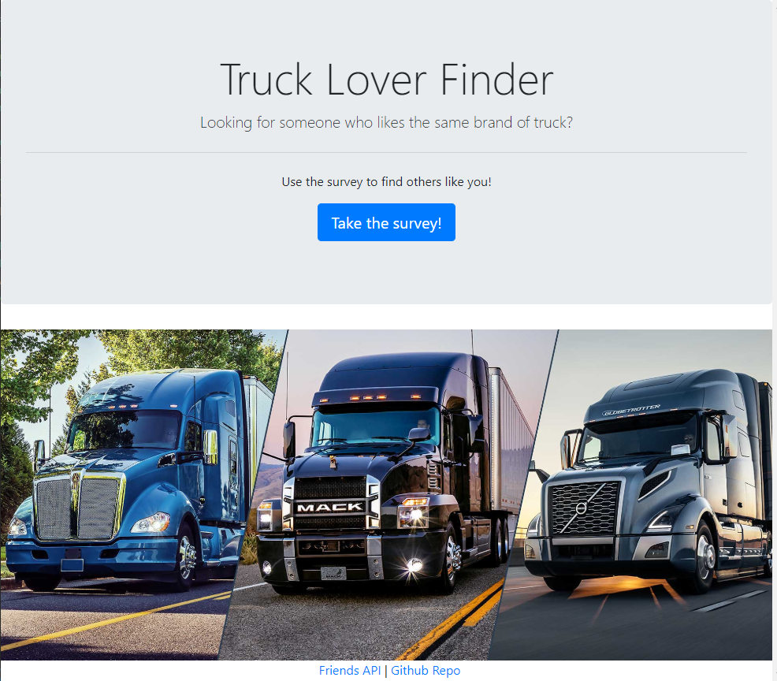
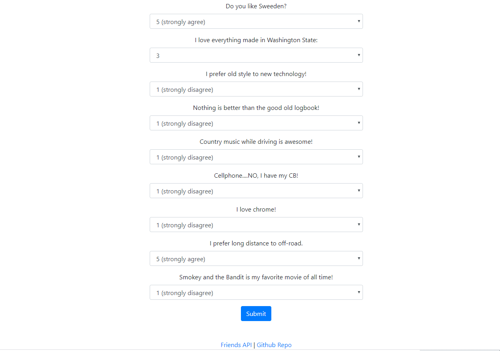
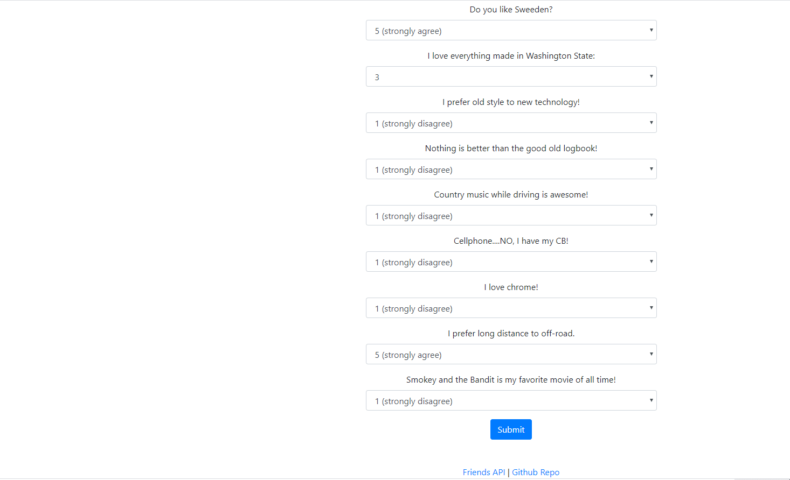

# friend-finder

## Table of Content ##
*Overview,*
*Installation,*
*Technologies used,*

## Overview ##
 Users can find a match about what is their favorite truck.

## Installation ##
### Step 1: Git Clone ###
Clone friend-finder to your local git repo like the following:

The friend-finder project and its files should now be in your project folder.

### Step 2: Install Dependencies ###
Install the following dependencies listed in the *package.json* file:

*express*
*mysql*
*path*
*server*
*body-parser*
*npm install*

Once completed, you will see a *node_modules* folder in your local repo.

The dependencies should now be in the local node_modules folder.

## How it works ##

User answers questions related to trucks. Data are stocked in friends.js file. At the end the user can find a match and see who like the same trucks

## Technologies used ##
* Node.js
* html
* heroku
* Javascript
* NPM packages: 
  express, 
  path, 
  server, 
  mysql, 
  body-parser. 
  
## Authors ##
Sylvain David - Vanderbilt Bootcamp - 2020